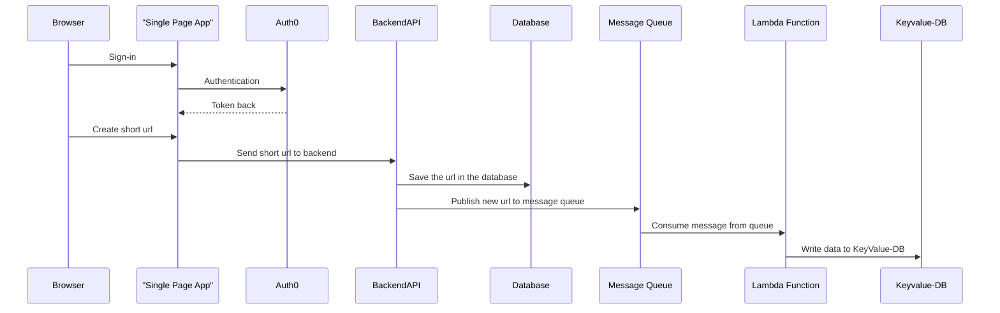

# MyURL Backend-API

[](https://github.com/Cloud-native-engineering/myurl_api/actions/workflows/testcases.yml)
[](https://github.com/Cloud-native-engineering/myurl_api/actions/workflows/containerbuild.yml)

This is a backend API for the MyURL service, a URL shortener. It provides endpoints for creating, retrieving, updating, and deleting shortened URLs. Built with Flask and SQLAlchemy, it offers a robust and flexible solution for managing and interacting with the URL data.

## Dataflow Diagram

The provided Mermaid diagram illustrates the data flow in the MyURL service:

1. The user initiates a sign-in process in the browser, which communicates with the Single Page App (SPA).
2. The SPA interacts with Auth0 for authentication and receives a token back.
3. The user requests to create a short URL through the browser, which is sent to the SPA.
4. The SPA forwards this request to the Backend API.
5. The Backend API saves the URL in the database and publishes a new URL message to the Message Queue.
6. The Message Queue triggers a Lambda Function by consuming the message.
7. Finally, the Lambda Function writes the data to a Key-Value Database.

This sequence ensures a secure and efficient process for creating and managing shortened URLs.



## Getting Started

To get a local copy up and running, follow these steps:

1. Clone the repo
2. Install the required packages
3. Run the application

An already configured Docker image is available on GitHub Packages for immediate use.

## Config / Environment Variables

The following Variables needs to be set in order that the API work:

```yaml
JWT_ISSUER_URL = "https://XX.eu.auth0.com/"
JWT_AUDIENCE = "https://localhost:5005"
JWKS_URI = 'https://XX.eu.auth0.com/.well-known/jwks.json'
DATABASE_URI = "postgresql://postgres:postgres@db:5432/postgres"
```

## License

This project is licensed under the [MIT License](https://opensource.org/licenses/MIT). See the [LICENSE](LICENSE) file for details.

## Author Information

This code was created in 2024 by [Yves Wetter](mailto:yves.wetter@edu.tbz.ch).
